## 电商购物系统——移动端

负责项目的整体搭建，完成 **1登陆注册**、**2主页面**、**3商品查询页面** 以及 **4购物车逻辑** 的开发，采用vw作为移动端适配方案

### 1 目录结构

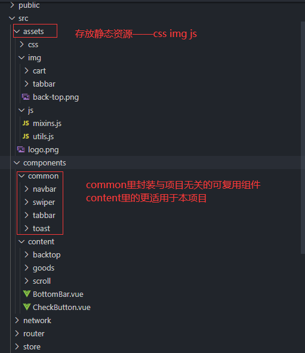

### 2 vue.config.js文件配置别名

```vue
module.exports = {
  publicPath: process.env.NODE_ENV === 'production' ? '/superMall/' : '/',
  configureWebpack: {
    resolve: {
      alias: {
        'components': '@/components',
        'content': 'components/content',
        'common': 'components/common',
        'assets': '@/assets',
        'network': '@/network',
        'views': '@/views',
      }
    }
  }
}
```

### 3 网络请求封装

将axios进行一些项目需要的基础配置，比如baseURL，拦截器等，返回一个新的axios实例，用于具体的网络请求

```js
import axios from 'axios'

axios.defaults.baseURL = process.env.NODE_ENV == 'development' ? '//47.99.134.126:28019/api/v1' : '//47.99.134.126:28019/api/v1'

// 在跨域请求时，会携带用户凭证
axios.defaults.withCredentials = true 

axios.defaults.headers['X-Requested-With'] = 'XMLHttpRequest'
// 判断用户登录状态是通过 token 来实现
axios.defaults.headers['token'] = localStorage.getItem('token') || ''
//post 请求时，发送 json 形式的数据包
axios.defaults.headers.post['Content-Type'] = 'application/json'
//interceptors 是拦截器，每个请求都会经过这个拦截器，返回的数据可以通过拦截处理后返回
axios.interceptors.response.use(res => {
  if (typeof res.data !== 'object') {
    console.log('服务端异常！')
    return Promise.reject(res)
  }
  if (res.data.resultCode != 200) {
    if (res.data.message) console.log(res.data.message)
    // 返回 416 代表没有登录状态，路由跳转到/login 页面
    if (res.data.resultCode == 416) {
      // this.$router.push({ path: '/login' }) // this指向错误
      window.vRouter.push('/login')
    }
    return Promise.reject(res.data)
  }
  return res.data
})

export default axios
```

### 4 common组件封装

#### I. TabBar组件

​	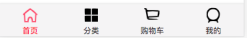

##### 	组件封装

1. 如果在下方有一个单独的TabBar组件，你如何封装
   - 自定义TabBar组件，在APP中使用
   - 让TabBar处于底部，并且设置相关的样式
2. TabBar中显示的内容由外界决定
   - 定义插槽（插槽用来放置item，放置几个由外界决定，每个item又可以封装成一个组件——》TabBarItem）
   - flex布局平分TabBar
3. 自定义TabBarItem，可以传入 图片和文字
   - 定义TabBarItem，并且定义三个插槽：未激活图片、激活图片、文字。
   - 给两个插槽外层包装div，用于设置样式。
   - 接收外界传入的参数，这个item代表的路径path，和外界设置的颜色color——props

##### TabBar.vue

​	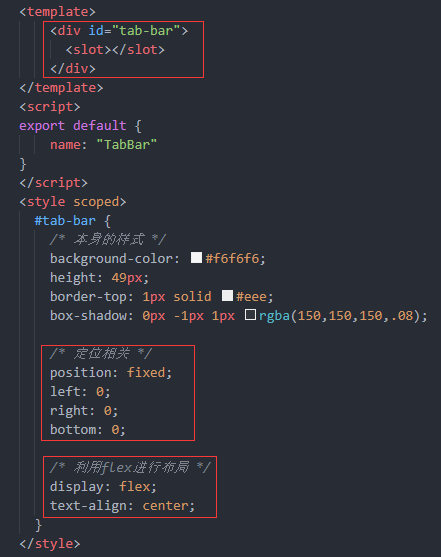

##### 	TabBarItem.vue

​	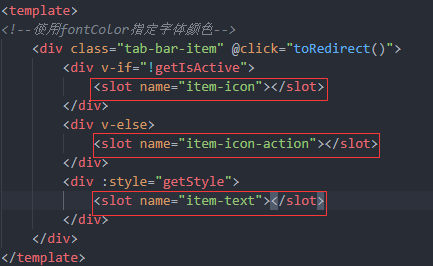

​	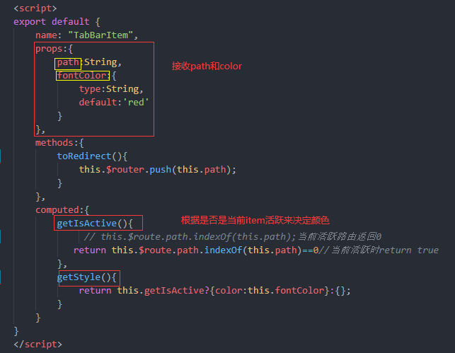

##### 组件使用

**BottomBar**

根据TabBar和TabBarItem的定义来使用

由定义得，TabBar定义的插槽用来填充TabBarItem，填充几个由需求决定

​					TabBarItem定义了三个具名插槽，使用时分别填充未激活img、激活img、文字；同时需传入path和color，path表示该item代表的路径，color是当前item激活时的文字颜色。在TabBarItem组件内部监听是否激活，由计算属性计算item代表的path与当前路由path是否一致决定

​	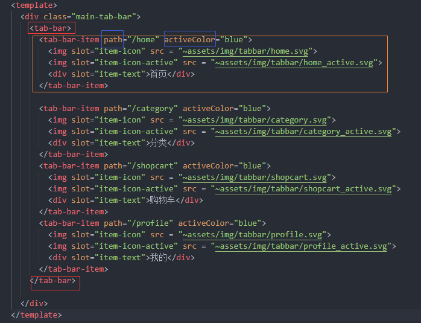

#### II. NavBar组件

##### 组件封装

	

1. NabBar中显示的内容由外界决定

   - 分析得，需要定义三个具名插槽，位于左中右（布局问题，左右位于两边，中间宽度自适应）
   - 布局使用div包裹起来布局，不要直接在slot上布局

   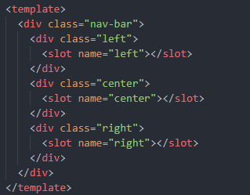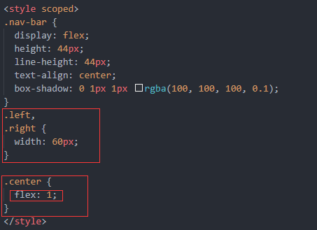

##### 组件使用

​	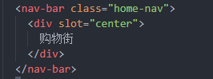

​	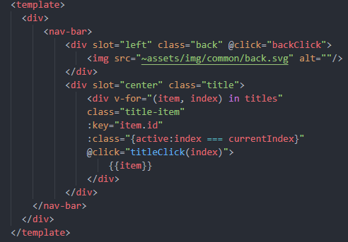

#### III. Toast组件——插件

实现目标，直接在需要用的地方使用 this.$toast.show(res, time)的方式，不需要再注册组件等

##### 插件方式封装

在文件入口处——main.js安装toast插件

```js
//安装toast插件
import toast from 'components/common/toast'

Vue.use(toast)  // 调用toast对象的install
```

插件内容我们自己实现

在toast文件夹中有index.js 和 Toast.vue，其中index.js引用了Toast.vue来构造插件

```js
// toast文件下的index.js文件

import Toast from './Toast';

const obj = {};

obj.install = function (Vue) {
    //1.创建组件构造器
    const toastConstrustor = Vue.extend(Toast);

    //2.new的方式, 根据组件构造器，可以创建出来一个组件对象
    const toast = new toastConstrustor();

    //3.将组件对象，手动挂载到某一个元素上
    toast.$mount(document.createElement('div'));

    //4.toast.$el对应的就是div
    document.body.appendChild(toast.$el);

    Vue.prototype.$toast = toast;
}

export default obj // 在main.js里面安装toast插件 import toast from 'components/common/toast'
				   // import toast 其实就是引入的这个 obj， 然后Vue.use(toast) 就是执行obj.install函数
```

##### 使用

```js
// 1. main.js注册并使用，见上文

// 2. 
      calcClick(){
        if(!this.isSelectAll){
          this.$toast.show('请选择要购买的商品'); // 使用方式
        }
      }

      this.addCart(product).then(res => {
        //console.log(res);
        this.$toast.show(res, 2000); // 使用方式
      })
```

### 5 content组件封装

#### I. BackTop组件

​	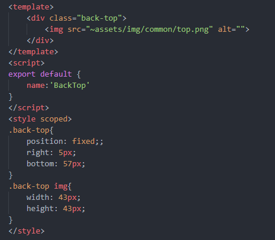

##### 使用

```
<back-top @click.native="backClick" v-show="currentScroll"></back-top>

mixins:[backTopMixin],
```

由于BackTop组件在点击后做出的反应是由外界自定义的，即backClick函数，

并且 1 BackTop组件在一个项目中也不一定只用一次——主页面、商品详情页都需要用到

​		 2 直接将backClick函数写在主页面中的话，如果还有其它类似BackTop组件这种独立的小功能，都写在主页面中，会使主页面代码逻辑显得很乱

因此把它封装在一个js文件中，使用混入mixin，混入到使用它的页面中

​	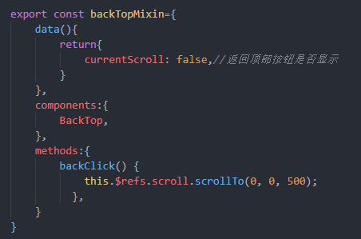

#### II. 二次封装better-scroll组件

根据项目需要的功能，二次封装better-scroll——无限滚动加载

```vue
<template>
  <div class="swiper" ref="swiper">
    <div class="content">
      <slot></slot>
    </div>
  </div>
</template>
<script>
import BScroll from "better-scroll";
export default {
  name: "Scroll",
  props:{
    /**是否监听滚动 */
    probeType:{
      type:Number,
      default(){
        return 0
      }
    },
    /**上拉加载更多 */
    pullUpLoad:{
      type:Boolean,
      default(){
        return false
      }
    }
  },
  data() {
    return {
      scroll: null //为true时scroll内的子元素如div span等能监听点击事件
    };
  },
  mounted() {
    this.scroll = new BScroll(this.$refs.swiper, {
      click: true,
      probeType: this.probeType ,//3时时监听滚动
      pullUpLoad:this.pullUpLoad//上拉加载更多
    })
     this.scroll.on('scroll', (position) => {//监听滚动
        this.$emit('scroll',position);    
      });
      this.scroll.on('pullingUp',()=>{
        this.$emit("pullingUp");
      })
  },
  methods: {
    scrollTo(x, y, timer = 500) {
      this.scroll.scrollTo(x, y, timer); //better-scroll内置方法，回到指定位置
    },
    finishPullUp(){//上拉加载更多完成
      this.scroll.finishPullUp();
    },
    refresh(){//从新计算滚动高度
      this.scroll.refresh();
      
    },
    getScrollY(){
      return this.scroll?this.scroll.y:0;
    }
  }
};
</script>
```

​	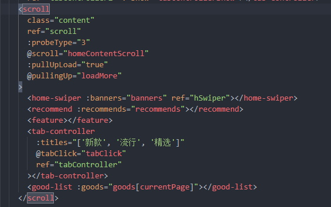

​	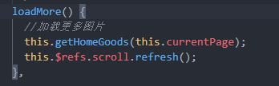

​	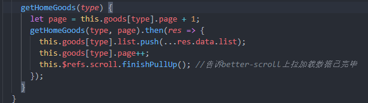

### 6. 移动端适配

postcss-px-to-viewport插件

postcss.config.js

​	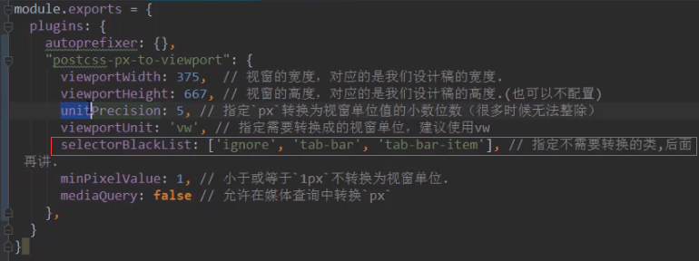

## 项目具体实现梳理

## 1 只在特定路由下显示BottomBar

```js
// App.vue
  data () {
    return {
      isShowNav : true,
      // 只在下列路径中展示bottom-bar
      showNavList : ['/home','/category','/user','/cart'],
    }
  },
  // 在主页面监听路由的改变，来判断路由
  watch: {
    $route(to, from){
      if(this.showNavList.includes(to.path)) {
        this.isShowNav = true
      }else{
        this.isShowNav = false
      }      
    }
  }
```

## 2 登陆注册——前端鉴权

cookie无法解决在某些没有浏览器的环境下的场景

### token

Token 是服务器生成的一串随机字符串或者一个 json 串，用于客户端进行资源请求的令牌。

当我们调用登录接口之后，服务端返回给前端一个 Token ，之后存储 Token 到本地环境，每次前端请求接口的时候，都需要在请求头里带上 Token 信息，并且 Token 可以在服务端设置过期时间。Token 过期之后，前端在请求失败回调 406（前后端协商好错误码）之后重新跳转到登录界面进行鉴权。

#### 在二次封装axios时进行前端鉴权

```js
// 判断用户登录状态是通过 token 来实现
axios.defaults.headers['token'] = localStorage.getItem('token') || ''

//interceptors 是拦截器，每个请求都会经过这个拦截器，返回的数据可以通过拦截处理后返回
axios.interceptors.response.use(res => {
  if (typeof res.data !== 'object') {
    console.log('服务端异常！')
    return Promise.reject(res)
  }
  if (res.data.resultCode != 200) {
    if (res.data.message) console.log(res.data.message)
    // 返回 416 代表没有登录状态，路由跳转到/login 页面
    if (res.data.resultCode == 416) {
      // this.$router.push({ path: '/login' }) // this指向错误
      window.vRouter.push('/login')
    }
    return Promise.reject(res.data)
  }

  return res.data
})

在每次网络请求时，都在请求头中添加token的值，后端会验证本次请求是否需要登陆状态，若需要，则会验证此token是否有效，若无效，返回状态码416（前后端协商），转至登陆页面。由于是在axios.js下，this.$router无效，需要在main.js中设置 window.vRouter = router，将router挂载到全局window下使用
```

- **登陆密码采用md5加密**
- 登录和注册通过变量去控制显示隐藏

## 3 主页面——轮播图、中部分类栏、下部无限滚动加载

```js
// 组件化思想, 每个页面最终的呈现效果都是一个个自定义组件
<template>
  <div id="home">
      <home-header></home-header>
      <scroll
        class="content"
        ref="scroll"
        :probeType="1"
        :pullUpLoad="true"
        @pullingUp="loadMore"
        @scroll="contentScroll"
      >
            <!-- 轮播图组件  -->
            <home-swiper :pics="pics"></home-swiper> 

            <!-- icon滑动组件 -->
            <icon-swiper :loop="false"></icon-swiper>

            <!-- 有限数量商品列表 -->
            <div class="title">热门商品</div>
            <good-list :goods="hot"></good-list>

            <div class="title">新品上线</div>
            <good-list :goods="news"></good-list>

            <!-- 无限滚动加载 -->
            <div class="title">推荐商品</div>
            <good-list :goods="recommend"></good-list>
      </scroll>

      <!--当我们需要监听一个组件的原生事件时，必须给对应的事件加上.native修饰符-->
      <back-top @click.native="backTop" v-show="isShowBackTop"></back-top>
  </div>
</template>
```

### 中部分类栏

**实现手滑轮播效果**

```js
<template>
  <swiper ref="swiper" class="my-swipe" :showIndicator="false" :loop="false">
    <swiper-item v-for="(page, index) in pages" :key="index">
        <div class="icon-item" v-for="item in page" :key="item.categoryId">
          <div class="img-wrapper">
            
          </div>
          <span class="name">{{item.name}}</span>
        </div>
    </swiper-item>
  </swiper> 
</template>

    computed: {
        pages () {
        const pages = []
        this.categoryList.forEach((item,index)=>{
            const num = Math.floor(index/8)
            if(!pages[num]){
            pages[num] = []
            }
            pages[num].push(item)
        })
        return pages
        } 
    }
```

### 无限滚动加载

```js
// 利用scroll内部监听pullingUp事件，配合pullUpTrue布尔值，具体看二次封装better-scroll

// 使用
      <scroll
        class="content"
        ref="scroll"
        :probeType="1"
        :pullUpLoad="true"
        @pullingUp="loadMore"
        @scroll="contentScroll"
      >
      ...
      </scroll>

    async loadMore() {
      //加载更多图片
        // 下拉加载
        if(this.page<this.totalPage){
            this.page = this.page + 1 
        }
        const { data, data: { list } } = await search({pageNumber: this.page, keyword: '手机'})
        
        this.recommend = this.recommend.concat(list)// this.productList = list
        this.totalPage = data.totalPage
        this.loading = false
        if(this.page >= this.totalPage) this.finished = true 
        
        //告诉better-scroll上拉加载数据已完毕 
        this.$refs.scroll.finishPullUp();
        //刷新scroll  
        this.$refs.scroll.refresh();
        
    },
```

## 4 商品查询页面

## 5 购物车逻辑

**接口请求来的购物车数据是没有checked index的，需要自行添加，设计数据结构**

购物车页面的状态管理，与vuex进行交互，不与网络请求交互，让vuex去与网络请求交互。dispatch

### 方案一：

1. 在详情页点击添加至购物车页面后，直接发送网络请求，更改购物车数据库

   ```js
     async onClickCart () {
         await addCart({goodsCount: 1, goodsId: this.goodsId})
   ```

2. 在点击进入购物车页面时，触发mounted钩子中，利用vuex获取购物车数据

   ```js
   // Cart.vue   
   async init() {
           await this.$store.dispatch('getCart')
   
           this.cartList = this.$store.state.cartList
       },
   // vuex
     // actions
       async getCart(ctx) {
         const { data } = await getCart()
         let num = 0;
         for (let i of data){
           Vue.set(i,'checked',false)
           Vue.set(i,'index',num)
           num++
         } 
         ctx.commit('getCart', data)
       },
     // mutations     
       getCart(state, payload) {
         state.cartList = payload  //直接替换掉state.cartList，不需要先移除再添加新数据
       },
   ```

   这种方案下，购物车页面无法使用keep-alive缓存，每次点击进入页面，都需要在vuex中用网络请求的数据覆盖掉state中的原数据

### 方案二：

在第一次写购物车逻辑时，我知道第一种解决方案肯定不好，不使用缓存，在每次进入购物车页面时都去重新请求后端cart数据库，当购物车有几十个商品时，每次请求要请求几十个商品的图片等信息，发送几十个http请求，性能会大幅下降

但是当时没有想到一个在进入购物车页面前 提前 请求历史购物车商品数据 的契机

**方案二解决了方案一的缺点，采用keep-alive作缓存，在main.js中执行 初始化购物车数据 的函数**

```js
// main.js

import { getCart } from 'network/cart'

async function initCartList() {
  const { data } = await getCart() // 网络请求
  let num = 0;
  for (let i of data){ // 对数据进行封装
    Vue.set(i,'checked',false)
    Vue.set(i,'index',num)
    num++
  }
  store.commit('initCartData', data)
  }

initCartList()
```

**在商品详情页添加商品到购物车时**

在js中封装一个购物车商品信息类，当商品详情页添加商品到购物车时，使用这个类生成该商品购物车数据实例，发送给vuex，将这个商品添加到state.cartlist中，在vuex触发的函数中发送addCart网络请求

```js
// 商品详情页            
// 方案二 /**购物车逻辑部分 */
            this.cartProduct = new cartProduct(
                // goodsId,goodscoverImage,originalPrice,goodsName,count
                this.goodsId, this.goodsCoverImg, this.originalPrice, this.goodsName, 1
            )
            this.$store.dispatch('judgeProduct', this.cartProduct);  
            this.$toast.show('加入购物车成功')
// vuex
    judgeProduct(context,product){
      let list = context.state.cartList;
      for(let i in list){
          if(list[i].goodsId==product.goodsId){
              context.commit("addCount",i);
              return;
          } 
      }
      context.commit("addProduct",product);
    },
        
    addProduct(state,product){
        product.index=state.cartList.length;
        state.cartList.push(product);
        addCart({goodsCount: 1, goodsId: product.goodsId})
    },
```

**在点击进入购物车页面时**

```js
    activated() {
       this.init()
    },

    init() {
       this.cartList = this.$store.state.cartList
    },
// 每次进入购物车页面都会执行activated钩子，此时将vuex state中的cartlist数据 赋值给 此页面data的cartlist, cartlist由main.js中 请求的历史购物车数据 和 此次进入网站后添加到购物车中的数据 组成
```

### 购物车商品选择 & 全选、取消全选

```js
// 购物车页面 Cart.vue
  <div id="cart">
    <NavBar>
      <template v-slot:center>购物车</template>
    </NavBar>
    <scroll class="cart-content" ref="scroll">
        <cart-list :cartList="cartList"></cart-list>  // 购物车商品列表，接收cartList数据(数据中已经封装了checked index)
    </scroll>
    <div class="submit-all"> // 全选、取消全选、结算金额栏
        <check-button :action="all" @checkClick="checkClick"></check-button>
        <span class="textall">全选</span>
        <span class="money">金额：￥{{total}}</span>
        <button @click="onSubmit">结算</button>
    </div>
  </div>

// CartList.vue
// 将接收来的cartList数据通过v-for传给每一个CartListItem
    <div class="cartlist" v-if="cartList.length!=0">
        <cart-list-item v-for="(item,index) in cartList" :key="index" :item="item"/>
    </div>

// CartListItem.vue
    <div class="cart-list-item">
        <check-button :action="item.checked" @checkClick="checkClick" class="checkButton"/>
        <div class="cart-content">
            
            <div class="good-mess">
                <div class="title">{{item.goodsName}}</div>
                <div class="buy">
                    <span class="price">￥{{item.sellingPrice}}</span>
                    <span class="count">x{{item.goodsCount}}</span>
                </div>
            </div>
        </div>
    </div>
```

#### CheckButton组件的封装

```js
// CheckButton.vue 
<div class="check" @click="checkClick">
        <!--动态绑定class时监听不到对象里属性的变化如：:class="{action:item.checked}，通过click时修改item.checked时样式并不会随之变化--> // 需要通过外界改变接收的数据
        <div class="item" :class="{action:action}"></div>
    </div>

    props:{
        action:{ // 实际是item.checked
            type:Boolean,
            default(){
                return false
            }
        }
    },
    methods:{
        checkClick(){
            // this.action=!this.action; // 直接改变接收来的action不行，动态绑定class时监听不到对象里属性的变化
            this.$emit("checkClick");
        }
    }

// CartListItem.vue 
// CheckButton的父组件
        checkClick(){
            this.$store.commit("modifyChecked",this.item.index);
        }

//vuex
    modifyChecked(state,index){
      state.cartList[index].checked=!state.cartList[index].checked;
    }, // 改变state.cartList会直接响应到Cart.vue中的this.cartList
       // Cart.vue   is.cartList = this.$store.state.cartList
```

#### 计算总金额

```js
    computed: {
        total: function() {
            let sum = 0
            let data_checked = this.cartList.filter(item => item.checked == true)
            data_checked.forEach(item => {
                sum+= item.goodsCount * item.sellingPrice
            })
            return sum
        },
    }
```

#### 全选、取消全选

```js
    <div class="submit-all">
        <check-button :action="all"  // 监听所有item是否都选中，都选中all变为true，否则all为false
					  @checkClick="checkClick"> // 通过点击执行全选、取消全选的操作
        </check-button>
        <span class="textall">全选</span>
        <span class="money">金额：￥{{total}}</span>
        <button @click="onSubmit">结算</button>
    </div>

computed: {
       all() { // 监听
            this.checkedItem = this.cartList.filter(item => item.checked == true)
            if(this.checkedItem.length == this.cartList.length)
            {
                this.checkAll = true
                return true
            }
            else {
                this.checkAll = false
                return false
            }
        }
}
methods: {
        checkClick() {
            if(this.checkAll) {
                this.checkAll = false
                this.$store.commit("unAllSelected"); 
            }
            else{
                this.checkAll = true
                this.$store.commit("allSelected"); 
            }        
        },
}

// vuex
    allSelected(state){
      state.cartList.forEach(item=>{
          return item.checked=true;
      })
    },
    unAllSelected(state){
      state.cartList.forEach(item=>{
          return item.checked=false;
      })
  	},
```

#### 结算

```js
        onSubmit() {
            const params = JSON.stringify(this.checkedItem.map(item=>item.cartItemId))  // 通过all计算的checkedItem，将他们的cartItemId取出来
            this.$router.push(`/createOrder?cartItemIds=${params}`)
        },
```

## 项目打包上线

vue-cli-service build --report 生成统计报告

**运行打包后的文件**

npm install -g serve

serve -s dist